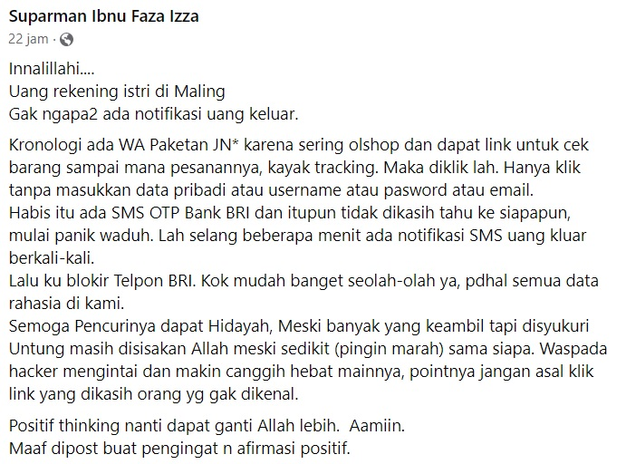

# membicarakan-penipuan-online
Salam Kamsib!

### Jumat, 25 November 2022

Pagi ini ketika bangun tidur, seperti biasa, admin scrolling grup [**Informatika Non-FLOSSposting**](https://www.facebook.com/groups/informatika.cringeposting). Ternyata ada kabar kurang mengenakkan. Admin turut bersedih, tetap kuat untuk Bapak dan Istri. Semoga permasalahannya cepat selesai dan saldo bisa kembali balik.

Dengan segala hormat, admin mengucapkan terima kasih kepada **Pak Aasher Vaalheit** sudah membagikan postingan dan mohon izin kepada **Pak Suparman Ibnu Faza Izza** untuk menjadikan ini sebuah tulisan. Semoga sedikit dapat membantu teman-teman pembaca untuk lebih waspada lagi terhadap segala bentuk penipuan.

# OUTLINE
1. Kronologi
2. Screenshot
3. Analisis
4. Paper Ilmiah
5. Apa yang bisa dilakukan selanjutnya?
6. Pengingat

# KRONOLOGI 

> Kronologi ada WA Paketan JN* karena sering olshop dan dapat link untuk cek barang sampai mana pesanannya, kayak tracking. Maka diklik lah. Hanya klik tanpa masukkan data pribadi atau username atau pasword atau email. 
Habis itu ada SMS OTP Bank BRI dan itupun tidak dikasih tahu ke siapapun, mulai panik waduh. Lah selang beberapa menit ada notifikasi SMS uang kluar berkali-kali. 
Lalu ku blokir Telpon BRI. Kok mudah banget seolah-olah ya, pdhal semua data rahasia di kami. 

# SCREENSHOT

## 1. Postingan Facebook

Berikut adalah postingan dari korban.

## 2. Screenshot Saldo Terkuras (SMS)

## 3. Screenshot Chat dengan Pelaku 

## 4. Validasi Bahwa Melakukan Instalasi APK

## 5. Screenshot Chat dengan Pelaku Meminta Instal APK

Pada screenshot ini, terlihat bahwa pelaku mengirim dan menyuruh untuk menginstal **J&T_Express.apk**. Di tahap inilah kita perlu CURIGA. Mengapa pelaku mengirimkan APK? Hal ini sebernya sama saja dengan kecurigaan kita terhadap **_LINK PHISHING_** yang dikirimlah oleh penjahat melalui SMS ataupun WhatsApp.

# ANALISIS
Berdasarkan kronologi yang diberikan. Sepertinya korban memang sudah cukup aware dengan tidak ada membuka LINK yang meminta untuk memasukkan data pribadi. Namun, di sini **korban melakukan isntalasi aplikasi mobile (.APK) yang tidak sah**. 

Admin menduga bahwa apliaksi ini merupakan _malicious app_. Di mana dengan cukup menginstal aplikasi jahat ini, pelaku sudah bisa mengakses sepenuhnya handphone korban. Sedikit gambaran, berikut admin sertakan sebuah **penelitian ilmiah** mengenai perilaku dari Apliaksi Android yang malicous (berbahaya).

BERHATI-HATI!

# PENELITIAN

# Apa yang bisa dilakukan selanjutnya?

- Lapor polisi
- Lapor ke bank untuk pembekuan dana

# PENGINGAT

- Jangan klik sembarangan
- Jangan instal aplikasi sembarangann
- Jangan suka download film/game bajakan dari situs bajakan
- Selalu waspada
- Selalu waspada
- Selalu waspada

# FOOTNOTE
- https://github.com/kamarkamsib/security-awareness

## Research
- Analysis of Malicious Behavior of Android Apps (Pooja Singh, Pankaj Tiwari, Dr. Santosh Singh)
- - https://www.researchgate.net/publication/300079946_Analysis_of_Malicious_Behavior_of_Android_Apps
